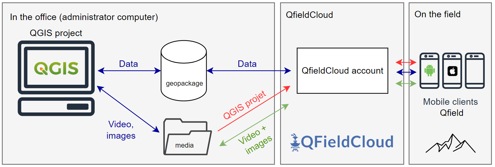

# TempAqua_App

Data and code related to the ENAC-IT4R OS Grant proposal, period Nov 2022 - Jun 2023

# Introduction

The TempAqua App allows for detailed mapping of temporal streams  and other ecohydrological features, as well as for documenting physical variables and soft data. 

The  application is configurable; users can import their maps and data, e.g., pre-defined observation  locations, landscape features such as stream networks and catchments boundaries. 

With this, the  App helps users to navigate in complex terrain and to collect data at the correct locations. The  data collection with the TempAqua App is straightforward and intuitive: The users navigate to  interesting locations based on their current position and imported maps. Then, they enter the  observations, such as stream state, discharge, water level, comments, photos, and even movies through the GUI. 

The App automatically connects stream sections, color codes them depending on  the flow state and shows them on the map so that the users immediately see the progress of their survey. The App  does not require an internet connection during data collection. An internet connection is only  needed once when, after the survey, the users export their data directly to the database. 

The App also syncs previoulsy exported surveys, so that all  users with access to the same database can immediately retrieve information about previous  surveys, which assures consistency in data collection when several researchers collect data for  the same project in the same region.

# Applicative architecture

The system is composed with the following elements : 

* **QGIS** : open-source desktop geographic information system (GIS) software.

* **QField**  : open-source mobile GIS application for Android and Iphone. It is designed to work with QGIS. QField allows users to take their QGIS projects into the field, collecting and editing data.

* **QFieldCloud** : a service that allows users to synchronize and share their QGIS projects and data with QField,

[Installation](doc/INSTALLATION.md)

# Usage
## Processing scripts

### Script installation

To install:

1. In QGIS, go to Processing > Toolbox.
2. On the second icon from the left, select “Add a script to Toolbox…”.
3. Navigate to the `/qgis/` folder and select the script.

The script will appear at the bottom of the window.

### Script execusion

To run a script without logs

1. double click on the script 

To run a script with a log:

1. Right-click on the script.
2. Select "Edit Script...".
3. In the code window, click on the green arrow in the menu bar above.
4. Click "Run" on the new window that appears.

### tempAqua_archiving.py

This script performs the following actions:

- It validates the project by ensuring that it contains at least four layers, with at least two layers ending with '_archive', and at least two layers with names containing "media".
- It transfers new or modified features from the normal table to the archived counterpart.