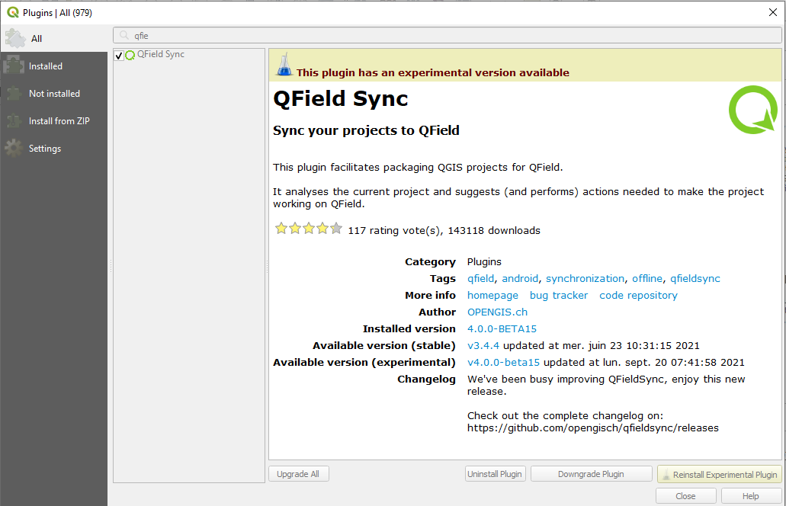
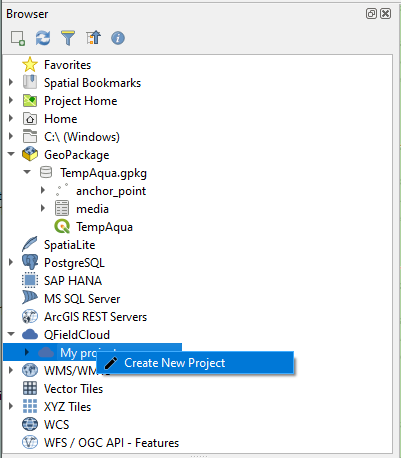
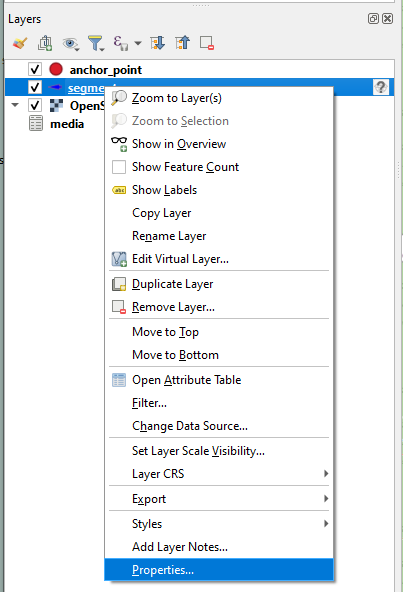

# TempAqua_App

Data and code related to the ENAC-IT4R OS Grant proposal, period Nov 2022 - Jun 2023

# Introduction

The TempAqua App allows for detailed mapping of temporal streams  and other ecohydrological features, as well as for documenting physical variables and soft data. 

The  application is configurable; users can import their maps and data, e.g., pre-defined observation  locations, landscape features such as stream networks and catchments boundaries. 

With this, the  App helps users to navigate in complex terrain and to collect data at the correct locations. The  data collection with the TempAqua App is straightforward and intuitive: The users navigate to  interesting locations based on their current position and imported maps. Then, they enter the  observations, such as stream state, discharge, water level, comments, photos, and even movies through the GUI. 

The App automatically connects stream sections, color codes them depending on  the flow state and shows them on the map so that the users immediately see the progress of their survey. The App  does not require an internet connection during data collection. An internet connection is only  needed once when, after the survey, the users export their data directly to the database. 

The App also syncs previoulsy exported surveys, so that all  users with access to the same database can immediately retrieve information about previous  surveys, which assures consistency in data collection when several researchers collect data for  the same project in the same region.

# Applicative architecture

The system is composed with the following elements : 

* **QGIS** : open-source desktop geographic information system (GIS) software.

* **QField**  : open-source mobile GIS application for Android and Iphone. It is designed to work with QGIS. QField allows users to take their QGIS projects into the field, collecting and editing data.

* **QFieldCloud** : a service that allows users to synchronize and share their QGIS projects and data with QField,

# Installation

The following are the steps to install and utilize the TempAqua app, using a sample project as an example. After completing the installation process, users will have the capability to create their own data collection tool.

**Steps**

The installation process involves these steps:

1. [Install QGIS.](#1-QGIS)

2. [Get the project code](#2-Get-the-code)

3. [Create QFieldCloud account](#3-Create-QFieldCloud-account)

4. [Install QField on your mobile device.](#4-Install-QField-on-your-mobile-device)

5. [Deploy QGIS project on QFieldCloud](#5-deploy-qgis-project-on-qfieldcloud)

### 

### 1. QGIS

1. Download and Install the latest version (>= 3.30) from the [official web page](https://www.qgis.org/en/site/forusers/download.html).

2. In QGIS, open the plugin library and search for **qfield sync**. Select
   the plugin in the list and click on **Install**.
   

### 

### 2. Get the Code

Option 1 : With git

    **⚠️ Requirement : git must be installed on your computer**

    Clone the repository: 

    `git clone https://github.com/TempAqua/TempAqua_App.git`

Option 2 : Download the zip file 

    Download [this file](https://github.com/TempAqua/TempAqua_App/archive/refs/heads/main.zip) and unzip it on you localmchaine. 

### 3. Create QFieldCloud account

Visit the web page of https://qfield.cloud/ and follow the intructions. 

A Pro account is a prerequisite for :

* sharing your project privately among different user on the field.

* having 1 GB of disk space in the cloud (100 MB for the free version). Uploading videos could be heavy.  

### 4. Install QField on your mobile device

To install, please follow [this link](https://docs.qfield.org/get-started/).

### 5. Deploy QGIS project on QFieldCloud

These few steps should only be performed once during the project initialization process.

1. Create an emplty folder where you want to store the project

2. Start QGIS (an empty project)

3. From QGIS, open the template project as follow : 
   
   - In QGIS > Browser > GeoPackage
     
   
   - Right click > New Connection ... > open `.../TempAqua_App/qgis/TempAqua.gpkg`
   
   - In `TempAqua.gpkg` > Double click `TempAqua` to open the project
     
     Loading the TempAqua template project provides access to fictitious data that can be edited as desired.

4. Convert the project to QField project:
   
   - In QGIS > Browser > QFieldCloud > My projects
   - Right click > Create new project
     
   - Convert currently open project to cloud project (recommended)
   - Click next and fill the required information
   - Chose you local folder
   - Close QGIS

5. Fix cloud settings in project:
   
   - Open the newly created QGIS project
   - In Layers planel > Right click on the segments layer > Properties 
        
   - In QField tab > change Cloud layer action to `Directly access data source`

6. Push changes to QFieldCloud:
   
   - Save project
   - Menu `Plugins` > `QFieldSync` > `Synchronize Current Cloud Project`

# Usage
## Processing scripts

### Script installation

To install:

1. In QGIS, go to Processing > Toolbox.
2. On the second icon from the left, select “Add a script to Toolbox…”.
3. Navigate to the `/qgis/` folder and select the script.

The script will appear at the bottom of the window.

### Script execusion

To run a script without logs

1. double click on the script 

To run a script with a log:

1. Right-click on the script.
2. Select "Run 'Edit Script'".
3. In the code window, click on the green arrow in the menu bar above.

### tempAqua_archiving.py

This script performs the following actions:

- It validates the project by ensuring that it contains at least four layers, with at least two layers ending with '_archive', and at least two layers with names containing "media".
- It transfers new or modified features from the normal table to the archived counterpart.