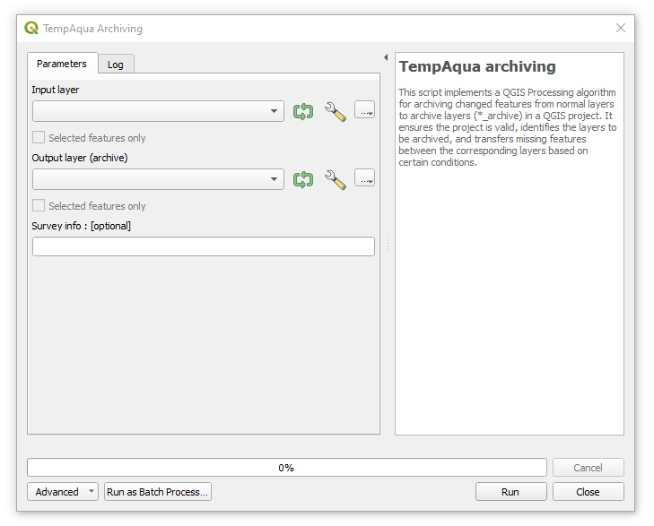

> [Main page](../README.md)

# User guide

This page give information on how to use the TempAqua application.

## How to work with TempAqua ? 

The standard process for working with TempAqua is as follows: 

## Publish the survey (QGIS project) on QFieldCloud

### Initial publication

> These few steps should only be performed once during the project initialization process.

1. Create an emplty folder where you want to store the project

2. Start QGIS (an empty project)

3. From QGIS, open the template project as follow : 
   
   - In QGIS > Browser > GeoPackage
     
   
   - Right click > New Connection ... > open `.../TempAqua_App/qgis/TempAqua.gpkg`
   
   - In `TempAqua.gpkg` > Double click `TempAqua` to open the project
     
     Loading the TempAqua template project provides access to fictitious data that can be edited as desired.

4. Convert the project to QField project:
   
   - In QGIS > Browser > QFieldCloud > My projects
   - Right click > Create new project
     
   - Convert currently open project to cloud project (recommended)
   - Click next and fill the required information
   - Chose you local folder
   - Close QGIS

5. Fix cloud settings in project:
   
   - Open the newly created QGIS project
   - In Layers planel > Right click on the segments layer > Properties 
        
   - In QField tab > change Cloud layer action to `Directly access data source`

6. Push changes to QFieldCloud:
   
   - Save project
   - Menu `Plugins` > `QFieldSync` > `Synchronize Current Cloud Project`

### Update a existing QGIS project and data on QFieldCloud

> These few steps is performed when the QGIS project has already been published on QFieldCloud and you want to update it.

1. On GIS, click `Plugins` > `QFieldSync` > `Synchronize Current Cloud Project`

2. On the window that appears, click `Prefer Local` button. This will upload the local project to QFieldCloud and overwrite the existing project.

3. Click `Perform Action` button

   

## QfieldCloud project management

Please refer to the [official documentation](https://docs.qfield.org/get-started/tutorials/get-started-qfc/) for more information on how to manage QFieldCloud projects.

## Qfield 

Please refer to the [official documentation](https://docs.qfield.org/get-started/) for more information on how to manage QField projects on the mobile devices.

## Get the data from QFieldCloud to QGIS

To get the data from your field data collection, you need to download the data from QFieldCloud to QGIS. This is done as follow:

1. On GIS, click `Plugins` > `QFieldSync` > `Synchronize Current Cloud Project`

2. On the window that appears, click `Prefer Cloud` button. 

3. Click `Perform Action` button

## Processing scripts

We developed a set of scripts to automate the data collection process. These scripts are located in the `/qgis/` folder. The following sections describe how to use these scripts.

Installation process can be found [here](INSTALLATION.md).

### TempAqua_archiving.py

This script performs the following actions:

- It validates the project by ensuring that it contains at least four layers, with at least two layers ending with '_archive', and at least two layers with names containing "media".
- It transfers new or modified features from the normal table to the archived counterpart.

To run a script

1. double click on the script. The following window will appear:

2. Add optional information to be saved in the archived table. This information can be used to describe the survey or any changes made.
3. Click on `Run` button. The script will run and a log will be displayed in the window. The log will indicate the number of features that have been archived.

### TempAqua_empty_table.py

This script allows the user to empty all attributes in a table except for the primary key and geometry. This can be useful when starting a new survey and wanting to clear the table to start from scratch while maintaining the measurement positions.

To run a script

1. double click on the script. The following window will appear:

2. Select the layer you want to empty.
3. Click on `Run` button. The script will run and a log will be displayed in the window. 

